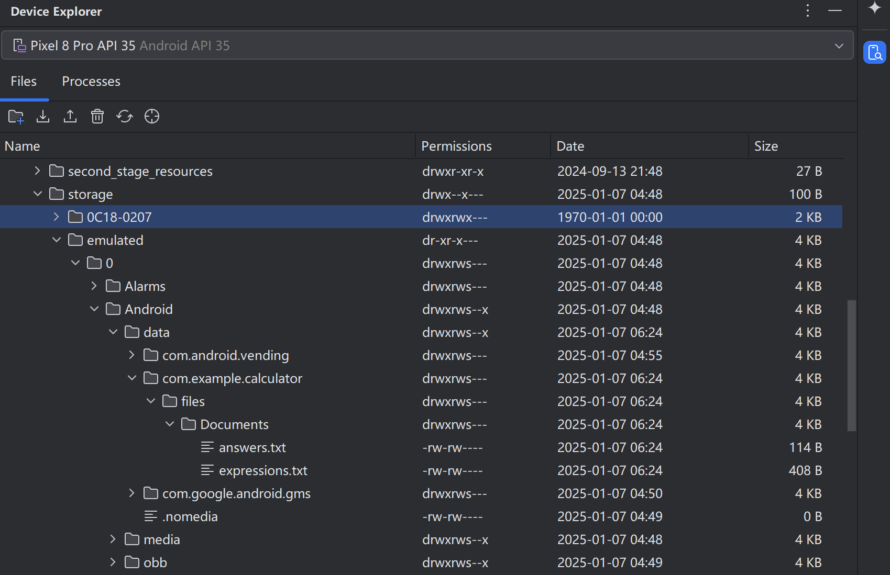

# 计算器和算式生成器（kotlin安卓项目）

## 项目环境

`Android Studio Koala 功能更新版 | 2024.1.2`

`gradle 8.7`

`JDK 17`

本安卓程序基于kotlin语言编写，分为 **计算器** 和 **算式生成器**两个功能模块

项目最外层有打包好的APP文件：**1999计算器.apk**，需要的可以下载到自己的安卓手机试试效果

## 计算器

- 上方显示计算式子和结果，下面利用网格布局设置了相关按钮，点击按钮可进行相关四则运算操作

- 目前修复了所有可能出现的bug，在输入算式不合法时会有相应的提示等处理

## 算式生成器

- 在该页面可以选择生成的式子数量以及每条式子的元素个数以及运算符种类

- 目前本程序支持四则运算以及括号匹配，支持优先级计算

- 指定好参数后点击生成，可在对应目录下找到运算式子文件`expressions.txt`以及答案文件`answers.txt`

两个文件的保存路径如下：

